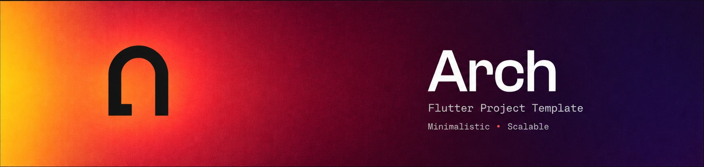
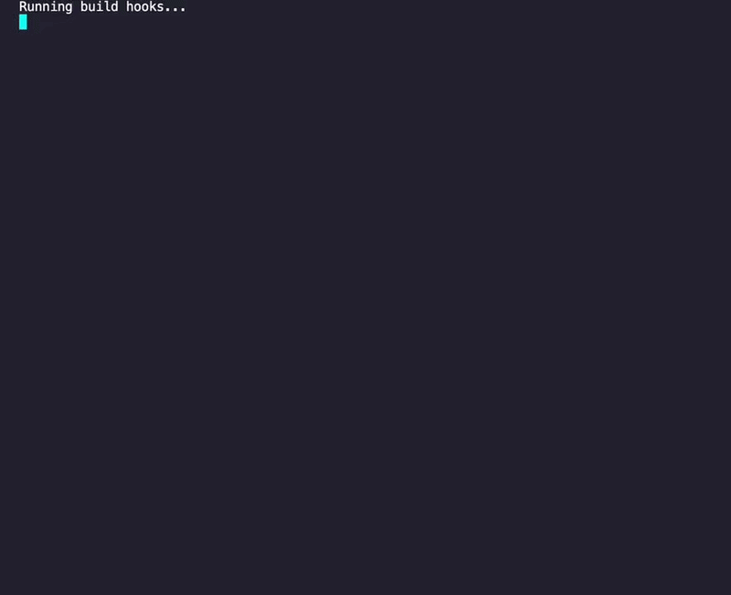

<div align="center">
  <h1 align="center">Arch</h1>
  <h3 align="center">A Flutter Project Template</h3>
  <h6 align="center">Minimalistic • Scalable</h3>
</div>

<div align="center">
  <a href="https://ko-fi.com/michmadheo" target="_blank">
    
  </a>
</div>

## Quick Start 🎮

In your new project folder:

```bash
git clone https://github.com/ArchPeople/flutter_project_template_arch.git
```

Or download via [releases](https://github.com/ArchPeople/flutter_project_template_arch/releases).

## Requirements 🛠️

These are the requirements to run this template:

- Java minimum version 17
- Flutter version 3.47.5
- dart version 3.13.4 (Should already be bundled with flutter)
- Android Studio minimum version Meerkat 2024.3.1
- Xcode up minimum version 16.4
- (Optional but recommended) mason_cli version 0.1.3

> [!IMPORTANT]
> Do not use a Flutter version above the one stated, as breaking changes may occur until we adjust for them.

> [!NOTE]
> Requirements doesn't match your setup? find another template version in [releases](https://github.com/ArchPeople/flutter_project_template_arch/releases).

## What's included 🚀

Essentials to ease your project setup. Here you can find:

- ✅ Compiled with the latest [Flutter](https://docs.flutter.dev/install/archive) version (See requirements)
- ✅ Tasty ready-to-use flavors, configured for development, staging & production environment (See [how to run](guide/how-to-run.md) guide)
- ✅ Consistent template for new feature with [mason_cli](https://pub.dev/packages/mason_cli) generator (See requirements)
- ✅ Hello! Bonjour! localization support with [easy_localization](https://pub.dev/packages/easy_localization)
- ✅ Swift Navigation & routing with [go_router](https://pub.dev/packages/go_router)
- ✅ Safe environment configuration with [envied](https://pub.dev/packages/envied)
- ✅ Robust API Fetching with [dio](https://pub.dev/packages/dio)
- ✅ Easy to use [bloc](https://pub.dev/packages/flutter_bloc) design pattern (see [demo_feature](lib/features/demo_feature) for example)
- ✅ "Functional" functional programming with [fpdart](https://pub.dev/packages/fpdart)
- ✅ Super fast key-value storage with [hive_ce](https://pub.dev/packages/hive_ce)
- ✅ Comparable object models with [equatable](https://pub.dev/packages/equatable)
- ✅ Manageable dependency injection with [get_it](https://pub.dev/packages/get_it)
- ✅ Assortment of ready-to-use themes for styling (see [themes](lib/app/themes) for example)
- ✅ Helpful utilities and extensions (see [general_helpers](lib/core/general_helpers) for example)
- ✅ Structured atomic design pattern for widgets (see [widgets](lib/app/widgets) for example)
- ✅ Everyone's favorite dark mode, is supported (see [system_mode_cubit](lib/app/global/system_mode/system_mode_cubit.dart) global cubit for usage)

Check the [pubspec.yaml](pubspec.yaml) for packages versions.

> [!TIP]
> Didn't like what's included? want to swap packages? feel free to do it!

## Get Started 📦

After cloning or downloading the project to your project folder, please run:

```bash
dart run .arch/init.dart
```

<p align="center">
  
</p>

Follow the prompts and instructions, then everything is ready 🚀

Run the app via [launch.json](.vscode/launch.json)

> [!IMPORTANT]
> Make sure that .env file exist in root project, for more info please read [how to run](guide/how-to-run.md) guide

## Guidance library 📚

For more guidance, please check the [guide](guide) folder

> [!IMPORTANT]
> Once you are ready to build the app, if you're using generated environment don't forget to delete the .env file after you've generated the config. Else, your .env file's contents will be shown if the app is being decompiled

## License

[MIT](LICENSE)
